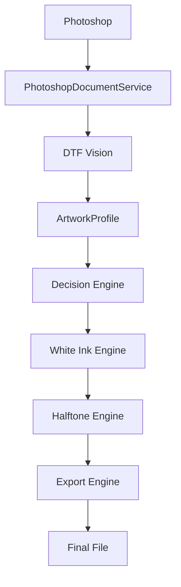
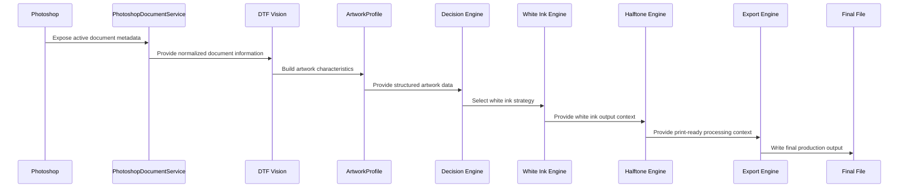

# DTF Master Plugin Flow

## Primary Flow

## Sequence Overview

## Stage Responsibilities

### Photoshop

Photoshop is the host application and source of the active document. DTF Master must treat Photoshop documents as production assets and avoid modifying them unless a future workflow explicitly requires and confirms a non-read-only operation.

### PhotoshopDocumentService

`PhotoshopDocumentService` is the read-only Adobe UXP adapter for active document metadata. It isolates Photoshop API details from the rest of the application and returns plain normalized objects.

Responsibilities:

- Access the active document.
- Read document metadata.
- Normalize values into simple data structures.
- Report clear errors when no document is open.
- Avoid destructive operations.

### DTF Vision

DTF Vision is the future analysis layer responsible for interpreting artwork characteristics. It will inspect document data and pixel-level signals when available, then produce structured artwork information for downstream engines.

Responsibilities:

- Detect transparency characteristics.
- Identify visual categories such as logo, photo, illustration, vintage, textures, gradients, glows, smoke, tiny text, and thin lines.
- Estimate detail level and print readiness.
- Avoid export or rendering decisions that belong to dedicated engines.

### ArtworkProfile

`ArtworkProfile` is the central domain model for analyzed artwork. It carries document dimensions, transparency metrics, detected content traits, recommended parameters, score values, and notes.

### Decision Engine

The Decision Engine converts an `ArtworkProfile` into processing recommendations. It should not manipulate Photoshop directly; it should produce decisions that other engines can execute or preview.

### White Ink Engine

The White Ink Engine generates or recommends underbase behavior for DTF output. It consumes decisions and artwork data, then prepares white ink output rules.

### Halftone Engine

The Halftone Engine produces halftone recommendations and future renderable output for DTF production.

### Export Engine

The Export Engine validates and writes final production files. It is the last workflow stage and must enforce safety rules before producing files.

### Final File

The final file is the production-ready artifact generated by DTF Master. It must reflect validated export settings and remain traceable to the source document and processing decisions.
