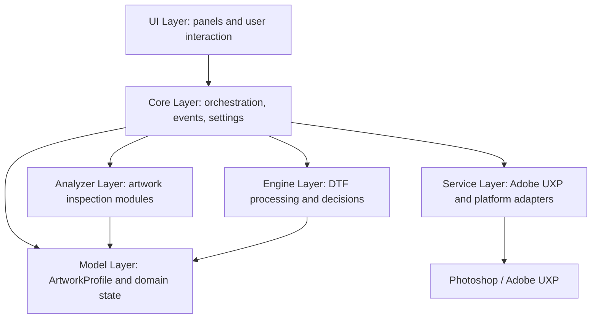
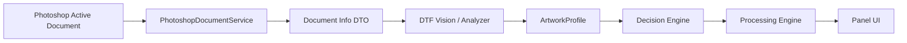
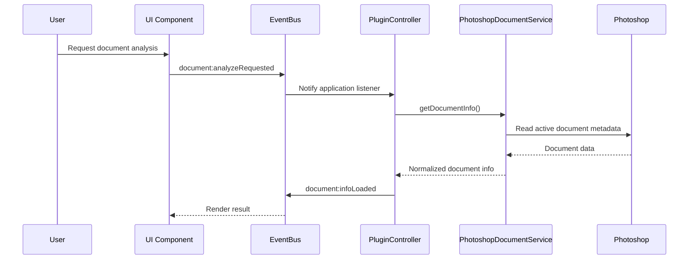

# DTF Master Technical Architecture

## Architecture Overview

DTF Master is an Adobe UXP plugin for Photoshop designed to support professional Direct-to-Film artwork preparation workflows. The architecture separates Photoshop integration, application orchestration, user interface, domain models, analysis modules, and processing engines so future features can be added without coupling the entire plugin to one implementation detail.

The project follows a Clean Architecture-inspired structure adapted to the Adobe UXP runtime. Photoshop is treated as an external system. All direct communication with the Adobe UXP and Photoshop APIs must be isolated inside service modules, while UI components communicate through application events and domain-facing contracts.



## Folder Structure

```text
src/
  assets/
  components/
  config/
  core/
  engine/
  models/
  services/
  ui/
  utils/
docs/
tests/
```

## Directory Responsibilities

| Directory | Responsibility |
| --- | --- |
| `src/assets` | Static files bundled with the plugin, including icons, images, and future visual resources. |
| `src/components` | Shared UI primitives that can be reused across panels without owning workflow logic. |
| `src/config` | Static configuration, defaults, and design tokens that are independent from runtime state. |
| `src/core` | Application lifecycle, controller logic, event registration, configuration management, and settings coordination. |
| `src/engine` | DTF processing modules and decision engines such as white ink, halftone, trap, sharpen, and export workflows. |
| `src/models` | Domain models and structured data objects, including `ArtworkProfile`. |
| `src/services` | External system adapters, especially Adobe UXP and Photoshop API integration. |
| `src/ui` | Panel layout, screen-specific components, user interactions, and view rendering. |
| `src/utils` | Small generic helpers with no ownership of product workflow or domain decisions. |
| `docs` | Technical documentation, contribution standards, roadmap, and architecture references. |
| `tests` | Automated tests for services, models, controllers, and future engines or analyzers. |

## Data Flow

Data moves from Photoshop through services into normalized application objects. Analysis modules and engines should consume normalized data or domain models instead of raw Photoshop objects. UI receives display-ready results through events or controller-provided state.



### Data Flow Rules

- Services return plain objects or domain models, never UI elements.
- UI components must not keep raw Photoshop document references.
- Engines must receive explicit input data and return explicit output data.
- Analyzers must populate or enrich domain models without exporting files or mutating UI state.
- Photoshop document modification must be opt-in, isolated, and documented in the responsible service or engine.

## Communication Between Modules

DTF Master uses an event-driven application boundary between UI and orchestration. UI components emit user intent. The core controller reacts to events, calls services or future engines, and emits result events back to the UI.



### Communication Rules

- UI publishes intent, not implementation commands.
- Controllers coordinate services, analyzers, engines, and models.
- Services isolate external APIs and platform-specific behavior.
- Engines and analyzers should not import UI modules.
- Cross-module notifications should use stable event names such as `document:infoLoaded`.

## Architectural Patterns

### Clean Architecture

The project keeps infrastructure concerns outside the domain and UI layers. Photoshop is external infrastructure, so direct Adobe UXP calls belong in services.

### SOLID

- Single Responsibility: each module has one reason to change.
- Open/Closed: new engines, services, and analyzers can be added without rewriting unrelated modules.
- Liskov Substitution: compatible implementations must preserve expected contracts.
- Interface Segregation: modules should depend only on the capabilities they need.
- Dependency Inversion: orchestration should depend on explicit dependencies rather than hidden globals.

### Event-Driven UI

UI components use events to request work and receive results. This avoids direct coupling between visual controls and Photoshop integration.

### Adapter Pattern

Services act as adapters around Adobe UXP, Photoshop APIs, storage, and future platform integrations.

### Domain Model Contracts

Domain models such as `ArtworkProfile` provide stable contracts between analysis, decision, processing, and UI layers.

## Adding New Engines

Engines belong in `src/engine` and represent DTF processing or decision modules. Examples include white ink generation, halftone rendering, trapping, sharpening, preview, and export.

Engine requirements:

- Create one class per engine.
- Keep the engine focused on one processing responsibility.
- Accept explicit dependencies through the constructor.
- Accept domain models or plain DTOs as method inputs.
- Return explicit results rather than mutating unrelated state.
- Do not render UI.
- Do not call Adobe UXP directly unless a service adapter is injected.
- Add tests for decision rules, edge cases, and error handling.

Recommended process:

1. Define the engine responsibility and inputs.
2. Define the output contract.
3. Add the class under `src/engine`.
4. Register it through the application composition layer when needed.
5. Add tests and documentation for the engine behavior.

## Adding New Services

Services belong in `src/services` and isolate external systems from the rest of the application. A service may wrap Photoshop, Adobe UXP storage, file export APIs, licensing APIs, or future system integrations.

Service requirements:

- Keep platform-specific details inside the service.
- Return plain objects or domain models.
- Throw meaningful errors for recoverable failures.
- Avoid UI rendering and DOM access.
- Avoid domain processing decisions that belong to engines.
- Support dependency injection for tests where practical.
- Include JSDoc for public methods and return types.

Recommended process:

1. Identify the external API boundary.
2. Define a small public service contract.
3. Normalize external data before returning it.
4. Add error handling for unavailable APIs or missing resources.
5. Add tests using mocked external dependencies.

## Adding New Analyzers

Analyzers inspect artwork characteristics and produce structured domain data. They should not export files, draw UI, or directly perform DTF output operations. Their main responsibility is to enrich `ArtworkProfile` or produce analysis DTOs for decision engines.

Analyzer requirements:

- Keep analysis logic separate from rendering and exporting.
- Use service-provided document data or safe pixel data as input.
- Produce deterministic output for the same input where possible.
- Populate clearly named fields on `ArtworkProfile` or return a documented analysis object.
- Avoid mutating Photoshop documents during read-only analysis.
- Add tests using controlled sample data.

Recommended process:

1. Define the artwork trait being analyzed.
2. Define the input data required for analysis.
3. Define the output fields or `ArtworkProfile` updates.
4. Add the analyzer module under the appropriate analysis or engine boundary.
5. Connect it through the controller or a future analysis pipeline.
6. Document limitations, assumptions, and confidence scoring if applicable.

## Safety Principles

- Reading Photoshop document metadata is safe by default.
- Any Photoshop document mutation must be explicit and isolated.
- Original user artwork must be preserved unless the user confirms otherwise.
- Export operations must validate target paths and settings before writing files.
- Batch operations must isolate failures per file.

## Future Architecture Direction

As DTF Master grows, the architecture should evolve toward explicit pipelines: document acquisition, vision analysis, artwork profiling, decision generation, processing preview, and export. Each pipeline step should have a documented input, output, error model, and test strategy.
